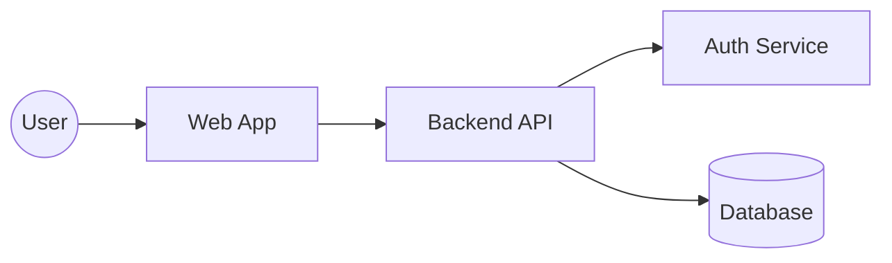

# Project Report

## Project Overview

**Project Name**: Personal Finance Tracker

**Group Members**:

- Student ID: 274502, Name: B M Nafis Fuad, GitHub username: nafis4139

**Brief Description**:
The **Personal Finance Tracker** is a web-based application that helps users manage and analyze their personal finances. It allows users to record their income and expenses, categorize transactions, and view visual summaries of their spending habits.

## Architecture Overview

### High-Level Architecture



### Components

- **Web App (Frontend):**  
  Built with React and TypeScript. It provides a responsive, dark-themed UI that allows users to add and view transactions, budgets, and spending analytics. Recharts is used for data visualization.
   
- **Backend API (Server):**  
  Implemented in Go using the Gin framework. It handles authentication, data validation, REST endpoints for categories, transactions, and budgets, and interacts with PostgreSQL via a repository layer.

- **Auth Service (JWT):**  
  Generates and validates JSON Web Tokens for secure session management.
    
- **Database (PostgreSQL):**  
  Stores users, categories, budgets, and transaction data. It supports user-level data isolation and relational integrity.

### Technologies Used

- **Backend**: Go (Gin)
- **Frontend**: React + TypeScript
- **Database**: PostgreSQ
- **Cloud Services**: Render (Frontend + Backend + Managed PostgreSQL)
- **Container Orchestration**: Docker
- **Visualization**: Recharts (for dashboards)

## Prerequisites

### System Requirements

- Operating System: Linux, macOS, Windows
- Minimum RAM: 8GB
- Storage: 10GB free space

### Required Software

- [Software 1] (version X.X or higher)
- [Software 2] (version X.X or higher)
- [etc.]

### Dependencies

```bash
# List key dependencies that need to be installed
# For example:
# Docker Engine 20.10+
# Node.js 18+
# Go 1.25+
```

## Build Instructions

### 1. Clone the Repository

```bash
git clone https://github.com/dat515-2025/Group-24.git
cd 7project
```

### 2. Install Dependencies

```bash
# Provide step-by-step commands
# For example:
# npm install
# go mod download
```

### 3. Build the Application

```bash
# Provide exact build commands
# For example:
# make build
# docker build -t myapp .
```

### 4. Configuration

```bash
# Any configuration steps needed
# Environment variables to set
# Configuration files to create
```

## Deployment Instructions

### Local Deployment

```bash
# Step-by-step commands for local deployment
# For example:
# docker-compose up -d
# kubectl apply -f manifests/
```

### Cloud Deployment

```bash
# Commands for cloud deployment
# Include any cloud-specific setup
```

### Verification

```bash
# Commands to verify deployment worked
# How to check if services are running
# Example health check endpoints
```

## Testing Instructions

### Unit Tests

```bash
# Commands to run unit tests
# For example:
# go test ./...
# npm test
```

### Integration Tests

```bash
# Commands to run integration tests
# Any setup required for integration tests
```

### End-to-End Tests

```bash
# Commands to run e2e tests
# How to set up test environment
```

## Usage Examples

### Basic Usage

```bash
# Examples of how to use the application
# Common commands or API calls
# Sample data or test scenarios
```

### Advanced Features

```bash
# Examples showcasing advanced functionality
```

---

## Presentation Video

**YouTube Link**: [Insert your YouTube link here]

**Duration**: [X minutes Y seconds]

**Video Includes**:

- [ ] Project overview and architecture
- [ ] Live demonstration of key features
- [ ] Code walkthrough
- [ ] Build and deployment showcase

## Troubleshooting

### Common Issues

#### Issue 1: [Common problem]

**Symptoms**: [What the user sees]
**Solution**: [Step-by-step fix]

#### Issue 2: [Another common problem]

**Symptoms**: [What the user sees]
**Solution**: [Step-by-step fix]

### Debug Commands

```bash
# Useful commands for debugging
# Log viewing commands
# Service status checks
```

---

## Progress Table

> Be honest and detailed in your assessments.
> This information is used for individual grading.
> Link to the specific commit on GitHub for each contribution.

| Task/Component                                                      | Assigned To | Status        | Time Spent | Difficulty | Notes       |
| ------------------------------------------------------------------- | ----------- | ------------- | ---------- | ---------- | ----------- |
| Project Setup & Repository                                          | Nafis      | ✅ Complete    | 1 hours  | Easy     |  |
| [Design Document](https://github.com/dat515-2025/Group-24/blob/main/7project/design.md)         | Nafis      | ✅ Complete    | 8 hours  | Medium       |  |
| [Backend API Development](https://github.com/dat515-2025/Group-24/tree/main/7project/personal-finance-tracker/backend) | Nafis     | ✅ Complete    | 32 hours  | Hard       |  |
| [Database Setup & Models](https://github.com/dat515-2025/Group-24) | Nafis      | ✅ Complete    | 10 hours  | Medium     |  |
| [Frontend Development](https://github.com/dat515-2025/Group-24/tree/main/7project/personal-finance-tracker/frontend)    | Nafis      | ✅ Complete | 16 hours  | Medium     |  |
| [Docker Configuration](https://github.com/dat515-2025/Group-24)    | Nafis      | ✅ Complete    | 12 hours  | Easy       |  |
| [Cloud Deployment](https://github.com/dat515-2025/Group-24/blob/main/render.yaml)        | Nafis      | ✅ Complete    | 15 hours  | Hard       |  |
| [Testing Implementation](https://github.com/dat515-2025/Group-24)  | Nafis      | ⏳ Pending     | X hours  | Medium     |  |
| [Documentation](https://github.com/dat515-2025/Group-24)           | Nafis      | ⏳ Pending    | X hours | Easy       |  |
| [Presentation Video](https://github.com/dat515-2025/Group-24)      | Nafis      | ⏳ Pending    | X hours  | Medium     |  |

**Legend**: ✅ Complete | 🔄 In Progress | ⏳ Pending | ❌ Not Started

## Hour Sheet

> [Link to the specific commit on GitHub for each contribution.](https://github.com/dat515-2025/Group-24/commits/main/?author=nafis4139)

### B M Nafis Fuad

| Date      | Activity                 | Hours      | Description                         |
| --------- | ------------------------ | ---------- | ----------------------------------- |
| 30 Oct    | Initial Setup            | 01      | Repository setup, project structure |
| 08 Nov    | Backend Development      | 32      | Implemented user authentication     |
| [Date]    | Testing                  | [X.X]      | Unit tests for API endpoints        |
| 08 Nov    | Documentation            | [X.X]      | Updated README and design doc       |
| 08 Nov    | Frontend Development     | 16      | Created user interface mockups            |
| 08 Nov    | Integration              | 04     | Connected frontend to backend API         |
| 08 Nov    | Deployment               | [X.X]      | Docker configuration and cloud deployment |
| [Date]    | Testing                  | [X.X]      | End-to-end testing                        |
| 08 Nov    | Database Design          | [X.X]      | Schema design and implementation |
| 08 Nov    | Cloud Configuration      | [X.X]      | Render setup and configuration  |
| [Date]    | Performance Optimization | [X.X]      | Caching and query optimization   |
| [Date]    | Monitoring               | [X.X]      | Logging and monitoring setup     |
| **Total** |                          | **[XX.X]** |                                     |


### Group Total: [XXX.X] hours

---

## Final Reflection

### What We Learned

[Reflect on the key technical and collaboration skills learned during this project]

### Challenges Faced

[Describe the main challenges and how you overcame them]

### If We Did This Again

[What would you do differently? What worked well that you'd keep?]

### Individual Growth

#### B M Nafis Fuad

[Personal reflection on growth, challenges, and learning]


---

**Report Completion Date**: [Date]
**Last Updated**: [Date]
