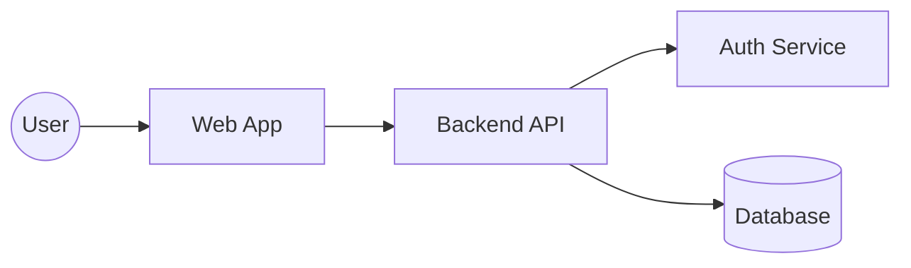
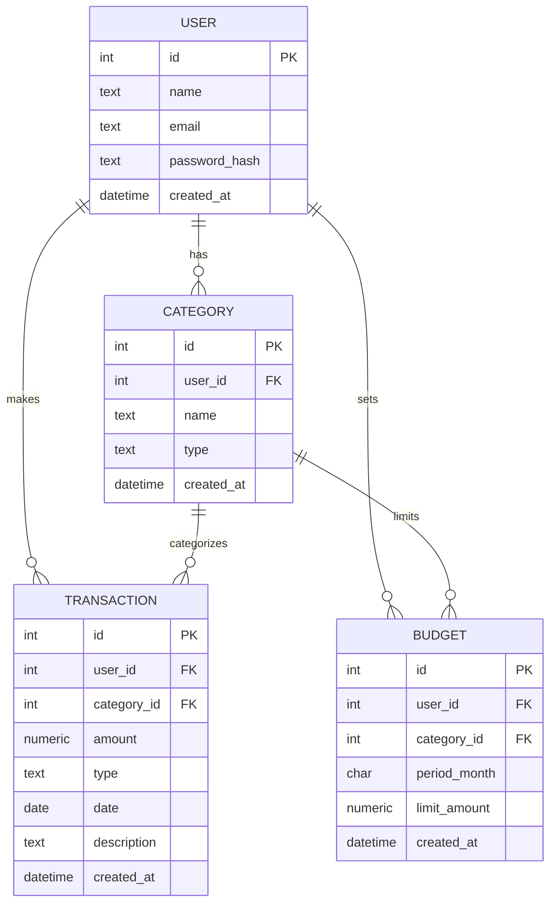
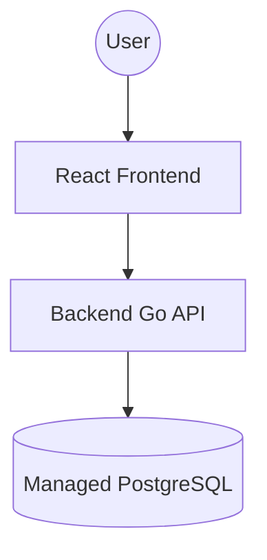

# Design Document

| Field          | Value                        |
| -------------- | ---------------------------- |
| Project Name   | Personal Finance Tracker     |
| Team Members   | B M Nafis Fuad               |
| Repository URL | https://github.com/dat515-2025/Group-24/tree/main/7project                            |
| Version        | v0.1                         |
| Last Updated   | 2025-10-30                   |

---

## 1. Overview
The **Personal Finance Tracker** is a web-based application that helps users manage and analyze their personal finances. It allows users to record their income and expenses, categorize transactions, and view visual summaries of their spending habits.

### Problem Statement
Many people struggle to monitor and control their daily expenses. This project provides an easy-to-use platform for tracking finances, identifying spending patterns, and setting simple budget goals.

### Target Users
- Students and young professionals seeking to manage personal expenses.
- Individuals wanting lightweight, secure budget tracking accessible from any device.

### Primary Objectives
- Implement user registration and authentication  
- Enable manual transaction entry with categorization  
- Provide spending analytics and budget tracking  
- Offer persistent cloud-based data storage  
- Deliver a simple, responsive web interface 

### Non-Goals
- No automated bank account integration or payment processing.
- No complex investment or tax features.

### Key Features
- User registration and login (JWT-based auth).
- CRUD operations for transactions and categories.
- Monthly budget overview and spending analytics dashboard.
- Responsive React frontend with simple visualization.
- Cloud deployment with persistent PostgreSQL storage.

## 2. Architecture
### 2.1 System diagram

The system is a classic three-tier web application:
- A React app in the browser
- A Go/Gin REST API on the server
- A PostgreSQL database hosted in the cloud (Render)

The frontend talks to the backend over `/api/*` endpoints, and the backend persists all data in PostgreSQL.

**Components and responsibilities:**  
1. **Web App (Frontend ):** 

Handles user interface, form inputs, and dashboards. Communicates with backend via REST API.
  - Built with React + TypeScript + Vite.
  - Uses React Router to provide pages for **Login / Register**, **Dashboard**, **Transactions**, **Categories**, **Budgets**.
  - Uses a small API helper (lib/api) to call the backend with fetch.
  - Stores the JWT token in `localStorage` and attaches it to `Authorization: Bearer ...` for authenticated requests.
  - Uses Recharts to render visualizations on the dashboard, for example spending by category, monthly trends etc.
  - Built as static files and served by Nginx inside the frontend Docker container.
  - Nginx is also configured as a reverse proxy so that browser requests to `/api/` are forwarded to the backend service on Render.
   
2. **Backend API (Server):** 

Exposes endpoints for authentication, transactions, categories, and budgets. Handles validation, business logic, and database access.
  - Implemented in Go using the Gin framework.
  - Core Structure:
    - `backend/cmd/api/main.go` is the main entrypoint that loads config (port, DB_DSN, JWT secret), connects to PostgreSQL, runs database migrations.
    - `backend/internal/handler/` contains HTTP handlers for each endpoint (e.g. /api/login, /api/transactions).
    - `backend/internal/repo/` contains the database/repository layer that runs SQL queries.
    - `backend/internal/model/` contains the Go structs that represent core entities (User, Category, Transaction, Budget).
    - `backend/internal/auth/` contains password hashing, JWT creation and verification.
    - `backend/internal/platform` contains configuration, migrations, and platform utilities.
  - API responsibilities:
    - User registration and login.
    - Validating and authenticating requests using JWT middleware.
    - CRUD operations for categories, transactions, and budgets.
    - Aggregation logic for dashboard summaries (e.g. monthly totals).

3. **Auth Service (JWT):** 

Issues and validates JWT tokens for authenticated requests.
  - Uses JSON Web Tokens for stateless authentication.
  - On `/api/login`:
    - Checks the user’s email/password (using hashed passwords).
    - Returns a signed JWT containing the user ID and expiry.
  - The frontend stores this token and sends it on every request in the Authorization header.
  - A Gin middleware (JWTMiddleware) verifies the token:
    - Rejects missing/invalid tokens.
    - Extracts the user ID and attaches it to the request context.
  - All protected routes (`/api/me`, `/api/transactions`, `/api/budgets`, etc.) require a valid token.
    
4. **Database (PostgreSQL):** 

Stores persistent data such as users, transactions, categories and budgets.
  - Hosted as a managed PostgreSQL instance on Render (pft-db).
  - It Stores:
    - Users and credentials
    - User-defined categories
    - Transactions (income/expense entries)
    - Budgets per month per category
  - Accessed via pgx connection pool in Go.
  - Database schema is created and updated via migrations that run on startup.

**Deployment (Render + Docker):**
  - Both frontend and backend are containerized using Docker.
  - Backend service (pft-api):
    - Built from `backend/Dockerfile`.
    - Receives `DB_DSN` and `JWT_SECRET` from Render environment (via `render.yaml`).
  - Frontend service (pft-frontend):
    - Built from `frontend/Dockerfile` (Node build → Nginx serve).
    - Nginx forwards `/api/` calls to `https://pft-api-x9xf.onrender.com/api/`.
  - `render.yaml` describes:
    - The managed PostgreSQL database.
    - The backend and frontend services.
    - Environment variables and health check paths.

Each push to GitHub triggers a new build and deployment on Render.

**Data flow:**  
1. User submits actions in the Web App.  
2. Frontend sends authenticated requests (JWT) to the API.  
3. API validates & executes queries on PostgreSQL.  
4. API returns JSON for UI/Charts.

**State management:**  
- Persistent: PostgreSQL  
- Client session: JWT stored in browser (local storage) 
- No cache layer in this version.  

### 2.2 Data model
- User
  - Represents an application user.
  - Attributes: id, name, email, password_hash, created_at
  - Relationships:
    - One-to-many with Category (a user defines many categories)
    - One-to-many with Transaction (a user records many transactions)
    - One-to-many with Budget (a user sets many budgets)

- Category
  - Represents a spending or income category owned by a user.
  - Attributes: id, user_id, name, type (income or expense), created_at
  - Relationships:
    - Many-to-one with User
    - One-to-many with Transaction
    - One-to-many with Budget (e.g., monthly category budgets)
   
- Transaction
  - Represents a single income or expense entry.
  - Attributes: id, user_id, category_id, amount, type (income or expense), date, description, created_at
  - Relationships:
    - Many-to-one with User
    - Many-to-one with Category

- Budget
  - Represents a user’s limit for a month, optionally for a category.
  - Attributes: id, user_id, category_id (nullable for overall budget), period_month (YYYY-MM), limit_amount, created_at
  - Relationships:
    - Many-to-one with User
    - Many-to-one with Category
   

### 2.3 APIs (REST)
### **key Endpoints:** 
**1. Auth**

| Method | Endpoint | Description |
|--------|-----------|-------------|
| **POST** | `/api/auth/register` | Register a new user account (`name`, `email`, `password`) |
| **POST** | `/api/auth/login` | Authenticate and issue a JWT (`email`, `password`) |
| **GET** | `/api/me` | Retrieve current user profile (requires JWT) |

**2. Categories**

| Method | Endpoint | Description |
|--------|-----------|-------------|
| **GET** | `/api/categories` | List all categories belonging to the authenticated user |
| **POST** | `/api/categories` | Create a new category (`name`, `type` — income/expense) |
| **PUT** | `/api/categories/:id` | Update an existing category name or type |
| **DELETE** | `/api/categories/:id` | Delete a category (reassign or set NULL on related items) |

**3. Transactions**

| Method | Endpoint | Description |
|--------|-----------|-------------|
| **GET** | `/api/transactions?from=&to=&category_id=&type=&page=&limit=` | Retrieve filtered transaction list (by date, category, type, pagination) |
| **POST** | `/api/transactions` | Create a new transaction (`amount`, `type`, `category_id`, `date`, `description`) |
| **PUT** | `/api/transactions/:id` | Update an existing transaction |
| **DELETE** | `/api/transactions/:id` | Delete a transaction record |

**4. Budgets**

| Method | Endpoint | Description |
|--------|-----------|-------------|
| **GET** | `/api/budgets?month=YYYY-MM` | Get budgets for the specified month |
| **POST** | `/api/budgets` | Create a budget (`category_id` \| null, `period_month`, `limit_amount`) |
| **PUT** | `/api/budgets/:id` | Update a budget entry |
| **DELETE** | `/api/budgets/:id` | Delete a budget record |

**5. Dashboard / Reports**

| Method | Endpoint | Description |
|--------|-----------|-------------|
| **GET** | `/api/dashboard/summary?month=YYYY-MM` | Retrieve summary of income, expenses, and budgets for a month |
| **GET** | `/api/healthz` | Health check endpoint (used for uptime/monitoring) |

---

## 3. Technologies

| Technology / Service     | Role                         | Why chosen (brief)                | Alternatives |
|--------------------------|------------------------------|-----------------------------------|--------------|
| **Go (Gin)**             | Backend API                  | Fast, typed, simple handlers      | Node, Flask  |
| **React + TypeScript**   | Web App UI                   | Familiar, typed components        | Vue, Svelte  |
| **PostgreSQL**           | Database                     | Strong relational + constraints   | MySQL        |
| **Docker + Compose**     | Dev/Prod containers          | Reproducible env                  | Podman       |
| **Render**               | Hosting, managed Postgres    | Simple deploys, free tiers        | AWS/GCP/Azure|
| **Recharts**             | Charts                       | Quick, lightweight visuals        | D3           |
| **GitHub Actions**       | CI/CD                        | Build/test/deploy on push         | Jenkins      |

## 4. Deployment

**Environment:**  
- **Development:** Docker Compose locally  
- **Production:** Hosted on Render/Railway with managed PostgreSQL  

**Runtime platform:** Docker containers (frontend, backend, db)

**Configuration & secrets:**  
- Managed with `.env` files (JWT secret, DB credentials)  
- Stored securely in cloud environment variables  

**Build & release:**  
- GitHub Actions triggers build/test on push  
- Automatic deployment on main branch updates  

**Deployment steps:**  
1. Build Docker images for frontend and backend  
2. Push images to registry  
3. Deploy using Docker Compose or Render service configuration  
4. Connect backend to managed PostgreSQL instance  

**Scaling strategy:**  
- Stateless API allows multiple backend replicas  
- Managed DB handles automatic vertical scaling  
- Redis cache reduces database load 

---

## Optional Sections
### Security
- JWT-based authentication  
- Password hashing with bcrypt  
- HTTPS enforced by cloud provider  
- Environment-based secret management

### Scalability
- Redis caching for analytics  
- Load balancing through cloud platform 

### Monitoring & Logging
- `/healthz` endpoint for liveness checks  
- Cloud provider logging dashboard
